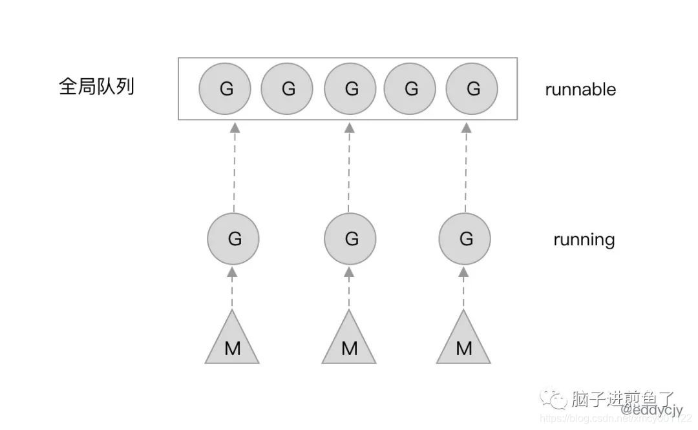

> 好文：https://yizhi.ren/2019/06/03/goscheduler

> 参考：https://blog.csdn.net/xmcy001122/article/details/119392934
> 
# Go 语言的协程 goroutine

Go 为了提供更容易使用的并发方法，使用了 goroutine 和 channel。goroutine 来自协程的概念，让一组可复用的函数运行在一组线程之上，即使有协程阻塞，该线程的其他协程也可以被 runtime 调度，转移到其他可运行的线程上。最关键的是，程序员看不到这些底层的细节，这就降低了编程的难度，提供了更容易的并发。
Go 中，协程被称为 goroutine，它非常轻量，一个 goroutine 只占几 KB，并且这几 KB 就足够 goroutine 运行完，这就能在有限的内存空间内支持大量 goroutine，支持了更多的并发。虽然一个 goroutine 的栈只占几 KB，但实际是可伸缩的，如果需要更多内容，runtime 会自动为 goroutine 分配。

Goroutine 特点：
- 占用内存更小（2KB左右，系统线程需要1-8MB）
- 调度更灵活（runtime 调度）
# 调度器

## 被废弃的 goroutine 调度器 - GM模型

Go 目前使用的调度器是 2012 年重新设计的，因为之前的调度器性能存在问题，所以使用 4 年就被废弃了，那么我们先来分析一下被废弃的调度器是如何运作的？

Go的调度程序是Go运行时的一个更重要的方面。运行时会跟踪每个Goroutine，并将安排它们在线程池中运行。goroutines与线程分离（解耦不强绑定），但运行于线程之上。如何有效地将goroutine调度到线程上对于go程序的高性能至关重要。

Goroutines的背后逻辑是：它们能够同时运行，与线程类似，但相比之下非常轻量。因此，程序运行时，Goroutines的个数应该是远大于线程的个数的。

同时多线程在程序中是很有必要的，因为当goroutine调用了一个阻塞的系统调用，比如sleep，那么运行这个goroutine的线程就会被阻塞，那么这时运行时至少应该再创建一个线程来运行别的没有阻塞的goroutine。线程这里可以创建不止一个，可以按需不断地创建，而活跃的线程（处于非阻塞状态的线程）的最大个数存储在变量GOMAXPROCS中。

### 简要说明

go运行时使用3个结构来跟踪所有成员来支持调度器的工作。

G的结构：

一个G代表一个goroutine，包含当前栈，当前状态和函数体。

```c

struct G

{

	byte∗ stackguard; // stack guard information
	
	byte∗ stackbase; // base of stack
	
	byte∗ stack0; // current stack pointer
	
	byte∗ entry; // initial function
	
	void∗ param; // passed parameter on wakeup
	
	int16 status; // status
	
	int32 goid; // unique id
	
	M∗ lockedm; // used for locking M’s and G’s
	
	...

}

```

M:

一个M代表一个线程，包含全局G队列，当前G，内存等。

```c

struct M

{

	G∗ curg; // current running goroutine
	
	int32 id; // unique id
	
	int32 locks ; // locks held by this M
	
	MCache ∗mcache; // cache for this thread
	
	G∗ lockedg; // used for locking M’s and G’s
	
	uintptr createstack [32]; // Stack that created this thread
	
	M∗ nextwaitm; // next M waiting for lock
	
	...

};

```

SCHED:

SCHED是全局单例，用来跟踪G队列和M队列，和维护其他一些信息。

```c

struct Sched {

	Lock; // global sched lock .
	
	// must be held to edit G or M queues
	
	G ∗gfree; // available g’ s ( status == Gdead)
	
	G ∗ghead; // g’ s waiting to run queue
	
	G ∗gtail; // tail of g’ s waiting to run queue
	
	int32 gwait; // number of g’s waiting to run
	
	int32 gcount; // number of g’s that are alive
	
	int32 grunning; // number of g’s running on cpu
	
	// or in syscall
	
	M ∗mhead; // m’s waiting for work
	
	int32 mwait; // number of m’s waiting for work
	
	int32 mcount; // number of m’s that have been created
	
	...

};

```

GM调度模型：
- G：Goroutine 的缩写，每次 go func() 都代表一个 G，无限制，但受内存影响。使用 struct runtime.g，包含了当前 goroutine 的状态、堆栈、上下文
- M：工作线程(OS thread)也被称为 Machine，使用 struct runtime.m，所有 M 是有线程栈的。M 的默认数量限制是 10000（来源），可以通过debug.SetMaxThreads修改。


运行时刚启动时会启动一些G,其中一个负责垃圾回收，其中一个负责调度，其中一个负责用户的入口函数。一开始运行时只有一个M被创建，随后，用户层面的更多G被创建，然后更多的M被创建出来执行更多的G。同时最多同时支持GOMAXPROCS个活跃的线程。

M代表一个线程，M需要从全局G队列中取出一个G并且执行G对应的代码，如果G代码执行阻塞的系统调用，那么会首先从空闲的M队列中取出一个M唤醒，随后执行阻塞调用，陷入阻塞。这么做是因为线程阻塞后，活跃的线程数肯定就小于GOMAXPROCS了，这时我们就可以增加一个活跃的线程以防止当前有G在等在M。

造成阻塞的都是系统调用，在调用返回之前，线程会一直阻塞。但是注意，M不会在channel的操作中阻塞，这是因为操作系统并不知道channel，channel的所有的操作都是有运行时来处理的。所以如果goroutine执行了channel操作，这时goroutine可能会需要阻塞，但是这个阻塞不是操作系统带来的阻塞，因此M并不需要一起阻塞。这种场景下，这个G会被标记为waiting，然后原来执行这个G的M会继续去执行别的G。waiting的G在channel操作完成后会设为runable状态，并把自己放回到原来那个q的队列下，等待空闲的M来执行，不一定是先前那个M了。为了完成g的唤醒，waitting的这个g必然会在wating前先找个地方某个字段某个数组保存。

M 想要执行、放回 G 都必须访问全局 G 队列，并且 M 有多个，即多线程访问同一资源需要加锁进行保证互斥 / 同步，所以全局 G 队列是有互斥锁进行保护的。

### 老调度器有几个缺点：

- 单一全局互斥锁(Sched.Lock)和集中状态存储。导致所有 goroutine 相关操作，比如：创建、结束、重新调度等都要上锁。

- Goroutine 传递问题。M 经常在 M 之间传递”可运行”的 goroutine，这导致调度延迟增大以及额外的性能损耗（刚创建的 G 放到了全局队列，而不是本地 M 执行，不必要的开销和延迟）

- 每一个M现在都持有一个内存，包括了阻塞状态的M也是持有的。Active状态的M跟总的M个数之比可以达到1:100。这就导致了过多的内存消耗，以及较差的数据局部性。数据局部性怎么理解呢？数据局部性这里是指G当前在M运行后对M的内存进行了预热，后面如果再次调度到同一个M那么可以加速访问，可想而知，因为现在G调度到同一个M的概率不高，所以数据局部性不好。

- 严重的线程阻塞/解锁。在系统调用的情况下，工作线程经常被阻塞和取消阻塞，这增加了很多开销。比如 M 找不到G，此时 M 就会进入频繁阻塞/唤醒来进行检查的逻辑，以便及时发现新的 G 来执行。

GM模型存在的问题在：Dmitry Vyukov “Scalable Go Scheduler Design Doc”有详细描述，推荐阅读
## 新调度器

### 调度器细节

Dmitry Vyukov的方案是引入一个结构P，用来模拟处理器，M依旧表示操作系统线程，G依旧表示一个goroutine。

GOMAXPROCS用来控制P的个数，同时P作为M执行G代码时的必需资源。

新的P结构会带走原来的M和SCHED结构中的一些属性，比如MCache从M移到了P，而G队列也被分成两类，SCHED结构保留全局G队列，同时每个P中都会有一个本地的G队列。


P的本地队列可以解决旧调度器中单一全局锁的问题。注意P的本地G队列还是可能面临一个并发访问的场景，比如下面讲到的窃取算法。为了避免加锁，这里P的本地队列是一个LockFree的队列，窃取G时使用CAS原子操作来完成。关于LockFree和CAS的知识参见[Lock-Free](https://yizhi.ren/2017/09/19/reorder/)。

### 调用过程

1. 创建一个G对象

2. 如果还有空闲的的P，创建一个M

3. M会启动一个底层线程，循环执行能找到的G

4. G的执行顺序是先从本地队列找，本地没找到从全局队列找。一次性转移(全局G个数/P个数）个，再去其它P中找（窃取算法（stealing algorithm）)

5. 当P执行系统调用即将阻塞时，M会释放P，并进入阻塞，直到系统调用返回时，M会尝试获取空闲的P，有的话继续执行，没有就把G会放到全局G，而M会进入空闲的M队列。

以上的G任务是按照队列顺序执行（也就是go函数的调用顺序）。

另外在启动时会有一个专门的sysmon来监控和管理，记录所有P的G任务计数schedtick。如果某个P的schedtick一直没有递增，说明这个P一直在执行一个G任务，如果超过一定时间就会为G增加标记，并且该G执行非内联函数时中断自己并把自己加到队尾。
### 新调度器中引入了线程自旋

自旋有好处有坏处，好处是避免线程被阻塞陷入内核，坏处是自旋属于空转，浪费CPU。只能说适度使用自旋是可以带来好处的。新方案在两个地方引入自旋：

1. M找不到P（目的是一有P释放就结合）
2. M找到了P但找不到G（目的是一有runable的G就执行）