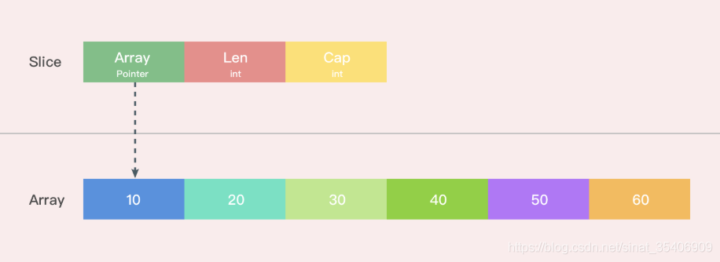

切片是一个拥有相同类型元素的可变长度的序列，它是基于数组类型做的一层封装。它非常灵活，支持自动扩容。

切片是一种引用类型，它有三个属性：**指针**，**长度**和**容量**。

[

底层源码定义如下：

```go
type slice struct {
    array unsafe.Pointer
    len   int
    cap   int
}
```

1. **指针：** 指向 slice 可以访问到的第一个元素。
2. **长度：** slice 中元素个数。
3. **容量：** slice 起始元素到底层数组最后一个元素间的元素个数。

比如使用 `make([]byte, 5)` 创建一个切片，它看起来是这样的：


## 扩容时机


当切片的长度超过其容量时，切片会自动扩容。这通常发生在使用 `append` 函数向切片中添加元素时。

扩容时，Go 运行时会分配一个新的底层数组，并将原始切片中的元素复制到新数组中。然后，原始切片将指向新数组，并更新其长度和容量。

需要注意的是，由于**扩容会分配新数组并复制元素，因此可能会影响性能**。如果你知道要添加多少元素，可以使用 `make` 函数预先分配足够大的切片来避免频繁扩容。

接下来看看 `append` 函数，签名如下：

```go
func Append(slice []int, items ...int) []int
```

切片扩容通常是在进行切片的 `append` 操作时触发的。在进行 `append` 操作时，如果切片容量不足以容纳新的元素，就需要对切片进行扩容，此时就会调用 `growslice` 函数进行扩容。

切片扩容分两个阶段，分为 go1.18 之前和之后：

**一、go1.18 之前：**

1. 如果期望容量大于当前容量的两倍就会使用期望容量；
2. 如果当前切片的长度小于 1024 就会将容量翻倍；
3. 如果当前切片的长度大于 1024 就会每次增加 25% 的容量，直到新容量大于期望容量；

**二、go1.18 之后：**

1. 如果期望容量大于当前容量的两倍就会使用期望容量；
2. 如果当前切片的长度小于阈值（默认 256）就会将容量翻倍；
3. 如果当前切片的长度大于等于阈值（默认 256），就会每次增加 25% 的容量，基准是 `newcap + 3*threshold`，直到新容量大于期望容量；