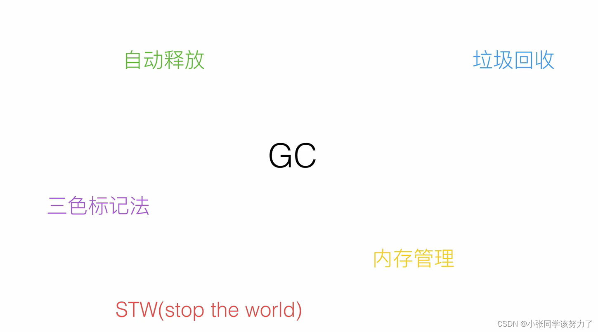

总体图

# Go V1.3之前的标记-清除：
1.暂停业务逻辑，找到不可达的对象，和可达对象
2.开始标记，程序找出它所有可达的对象，并做上标记
3.标记完了之后，然后开始清除未标记的对象。
4.停止暂停，让程序继续跑。然后循环重复这个过程，直到process程序生命周期结束

标记-清除的缺点：
STW（stop the world）：让程序暂停，程序出现卡顿
标记需要扫描整个heap
清除数据会产生heap碎片

为了减少STW的时间，后来对上述的第三步和第四步进行了替换。

# Go V1.5 三色标记法  
1. 把新创建的对象，默认的颜色都标记为“白色”

2. 每次GC回收开始，然后从根节点开始遍历所有对象，把遍历到的对象从白色集合放入“灰色”集合
3. 遍历灰色集合，将灰色对象引用的对象从白色集合放入到灰色集合，之后将此灰色对象放入到黑色集合
4. 重复第三步，直到灰色中无任何对象
5. 回收所有的白色标记的对象，也就是回收垃圾

三色标记法在不采用STW保护时会出现：

1. 一个白色对象被黑色对象引用
2. 灰色对象与它之间的可达关系的白色对象遭到破坏

这两种情况同时满足，会出现对象丢失

解决方案：
1.强三色不变式：强制性的不允许黑色对象引用白色对象（破坏1）
2.弱三色不变式：黑色对象可以引用白色对象，白色对象存在其他灰色对象对它的引用，或者可达它的链路上游存在灰色对象（破坏2）
