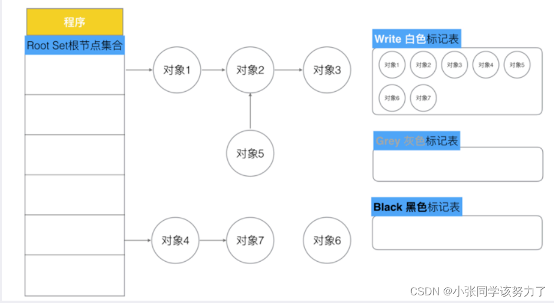

<!-- START doctoc generated TOC please keep comment here to allow auto update -->
<!-- DON'T EDIT THIS SECTION, INSTEAD RE-RUN doctoc TO UPDATE -->
**Table of Contents**  *generated with [DocToc](https://github.com/thlorenz/doctoc)*

- [Go V1.3之前的标记-清除：](#go-v13%E4%B9%8B%E5%89%8D%E7%9A%84%E6%A0%87%E8%AE%B0-%E6%B8%85%E9%99%A4)
- [Go V1.5 三色标记法](#go-v15-%E4%B8%89%E8%89%B2%E6%A0%87%E8%AE%B0%E6%B3%95)
  - [GC的触发条件](#gc%E7%9A%84%E8%A7%A6%E5%8F%91%E6%9D%A1%E4%BB%B6)
  - [GC调优](#gc%E8%B0%83%E4%BC%98)

<!-- END doctoc generated TOC please keep comment here to allow auto update -->

总体图

# Go V1.3之前的标记-清除：
1.暂停业务逻辑，找到不可达的对象，和可达对象
2.开始标记，程序找出它所有可达的对象，并做上标记
3.标记完了之后，然后开始清除未标记的对象。
4.停止暂停，让程序继续跑。然后循环重复这个过程，直到process程序生命周期结束

标记-清除的缺点：
STW（stop the world）：让程序暂停，程序出现卡顿
标记需要扫描整个heap
清除数据会产生heap碎片

为了减少STW的时间，后来对上述的第三步和第四步进行了替换。

# Go V1.5 三色标记法  
不会，需要去了解
1. 把新创建的对象，默认的颜色都标记为“白色”

2. 每次GC回收开始，然后从根节点开始遍历所有对象，把遍历到的对象从白色集合放入“灰色”集合
3. 遍历灰色集合，将灰色对象引用的对象从白色集合放入到灰色集合，之后将此灰色对象放入到黑色集合
4. 重复第三步，直到灰色中无任何对象
5. 回收所有的白色标记的对象，也就是回收垃圾

三色标记法在不采用STW保护时会出现：

1. 一个白色对象被黑色对象引用
2. 灰色对象与它之间的可达关系的白色对象遭到破坏

这两种情况同时满足，会出现对象丢失

解决方案：
1.强三色不变式：强制性的不允许黑色对象引用白色对象（破坏1）
2.弱三色不变式：黑色对象可以引用白色对象，白色对象存在其他灰色对象对它的引用，或者可达它的链路上游存在灰色对象（破坏2）

TODO: 完成GC

## GC的触发条件
第一种：主动触发(手动触发)，通过调用 runtime.GC 来触发GC，此调用阻塞式地等待当前GC运行完毕。
第二种：被动触发，分为两种方式：
1. 使用步调（Pacing）算法，其核心思想是控制内存增长的比例,每次内存分配时检查当前内存分配量是否已达到阈值（环境变量GOGC）：默认100%，即当内存扩大一倍时启用GC。
2. 使用系统监控，当超过两分钟没有产生任何GC时，强制触发 GC。
## GC调优
1. 控制内存分配的速度，限制Goroutine的数量，提高赋值器mutator的CPU利用率（降低GC的CPU利用率）
2. 少量使用+连接string
3. slice提前分配足够的内存来降低扩容带来的拷贝
4. 避免map key对象过多，导致扫描时间增加
5. 变量复用，减少对象分配，例如使用sync.Pool来复用需要频繁创建临时对象、使用全局变量等
6. 增大GOGC的值，降低GC的运行频率