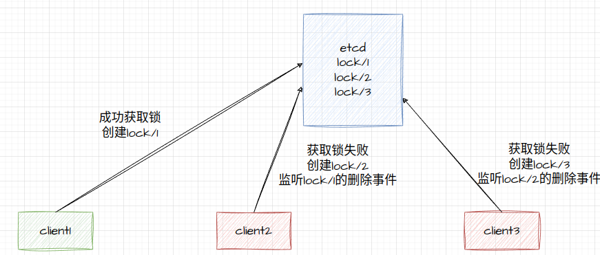

# 特点

- 互斥性：在同一时刻，只有一个客户端能持有锁
- 安全性：避免死锁，如果某个客户端获得锁之后处理时间超过最大约定时间，或者持锁期间发生了故障导致无法主动释放锁，其持有的锁也能够被其他机制正确释放，并保证后续其它客户端也能加锁，整个处理流程继续正常执行
- 可用性：也被称作容错性，分布式锁需要有高可用能力，避免单点故障，当提供锁的服务节点故障（宕机）时不影响服务运行，这里有两种模式：一种是分布式锁服务自身具备集群模式，遇到故障能自动切换恢复工作；另一种是客户端向多个独立的锁服务发起请求，当某个锁服务故障时仍然可以从其他锁服务读取到锁信息(Readlock)
- 可重入性：对同一个锁，加锁和解锁必须是同一个线程，即不能把其他线程持有的锁给释放了
- 高效灵活：加锁、解锁的速度要快；支持阻塞和非阻塞；支持公平锁和非公平锁

# ETCD实现的思路

## prefix
etcd支持前缀查找，所以可以用一个前缀表示锁资源，前缀 + 唯一id的方式表示锁资源的持有者。

## lease机制

租约机制可以保证锁的活性，持有锁的客户端宕机，key自动过期，避免宕机。etcd客户端提供的lease续租机制解决客户端长时间阻塞导致锁失效问题。

## watch机制
redis采用忙轮询的方式来获取锁，etcd可以使用watch机制监听锁的删除事件，更加高效。

## 实现策略
etcd实现分布式锁的方案有很多种，可以通过判断是否存在一个固定的key来实现分布式锁，但是这种实现策略有很大的问题。当多客户端同时获取锁时，只有一个成功获得，其余多个客户端监听key的删除事件，一旦锁被释放，多个客户端同时收到锁删除事件(无论尝试加锁的顺序)进行加锁，这就是 “惊群问题” ，所以etcd官网提供了另外一种实现策略。

不再将一个固定的key当作锁资源，而是将一个前缀当作锁资源，每一个客户端尝试加锁的时候都会以该前缀创建一个key，并且监听前一个创建该前缀key的版本号。


### 代码
使用etcd客户端concurrency包提供的分布式锁

```go
func NewLock() sync.Locker {  
	//创建客户端
   cli, err := clientv3.New(clientv3.Config{Endpoints: ip1,ip2...})  
   if err != nil {  
      log.Fatal(err)  
   }  
   //授权租约
   resp, err := cli.Grant(context.TODO(), 5)  
   if err != nil {  
      log.Fatal(err)  
   }  
   //创建会话
   //会话会创建一个租约，并在客户端生存期内保证租约的活性
   session, err := concurrency.NewSession(cli, concurrency.WithLease(resp.ID))  
   if err != nil {  
      log.Fatal(err)  
   }  
   //利用会话，指定一个前缀创建锁
   return concurrency.NewLocker(session, "/myLock/")  
}

```