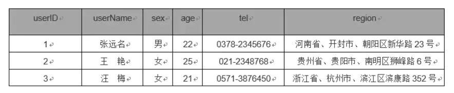
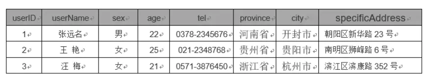
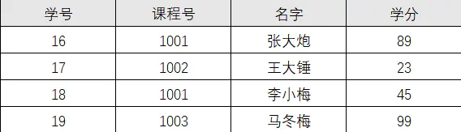
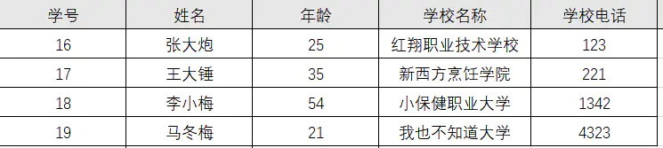

# 数据库设计范式

## 范式优点：
- 可以尽量的减少数据冗余，数据表更新快体积小
- 范式化的更新操作比反范式化更快
- 范式化的表通常比反范式化更小
## 缺点：
-  对于查询需要对多个表进行关联（导致性能降低）
- 更难进行索引优化
## 反范式化优点：
- 可以减少表的关联
- 可以更好的进行索引优化
## 缺点：
- 存在数据冗余及数据维护的异常
- 对数据的修改需要更多的成本 

## 例子
### 第一范式（1NF）
是对属性的 原子性 的要求，要求属性具有原子性，不可再分解；

如这个user表就不符合第一范式，因为region列不具有原子性，能拆分成省份、市和具体地址
正确做法

### 第二范式（2NF）
2NF是对记录的 唯一性 ，要求记录有惟一标识，即实体的惟一性，即不存在部分依赖；

这个表明显说明了两个事务：学生信息， 课程信息；
由于非主键字段必须依赖主键，这里学分依赖课程号，名字依赖与学号，所以不符合二范式。
这么做可能会存在问题：
- 数据冗余:，每条记录都含有相同信息；
- 删除异常：删除所有学生成绩，就把课程信息全删除了；
- 插入异常：学生未选课，无法记录进数据库；
- 更新异常：调整课程学分，所有行都调整。
正确做法:
- 学生：Student(学号, 姓名)；
- 课程：Course(课程号, 学分)；
- 选课关系：StudentCourse(学号, 课程号, 成绩)。

### 第三范式（3NF，又称巴斯-科德范式（BCNF, 对第三范式的补充））
3NF是对字段的 冗余性 ，要求任何字段不能由其他字段派生出来，它要求字段没有冗余，即不存在传递依赖；

因为存在依赖传递: (学号) → (姓名)→(所在学校) → (学校电话) 。
可能会存在问题：
- 数据冗余：有重复值；
- 更新异常：有重复的冗余信息，修改时需要同时修改多条记录，否则会出现数据不一致的情况 。
正确做法：
- 学生：(学号, 姓名, 年龄, 所在学院)；
- 学院：(学院, 电话)。

### 平时设计的时候都遵守三大范式吗？不遵守的话什么时候会去突破范式？

没有规矩不成方圆，一般下我会只遵守第三范式（3NF）。
没有冗余的数据库设计可以做到三大范式都遵守。但是，没有冗余的数据库未必是最好的数据库，有时为了提高运行效率，就必须降低范式标准，适当保留冗余数据。
具体做法是：在概念数据模型设计时遵守第三范式，降低范式标准的工作放到物理数据模型设计时考虑。
降低范式就是增加字段，允许冗余，达到以空间换时间的目的。

参考：https://juejin.im/post/5dfdc16751882512701d7461