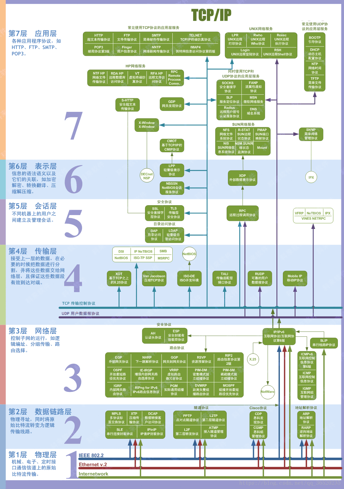
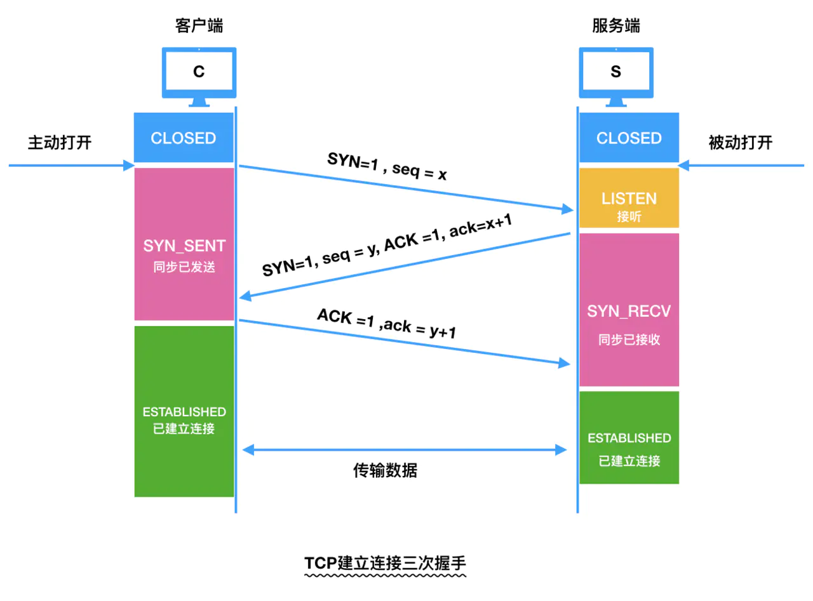
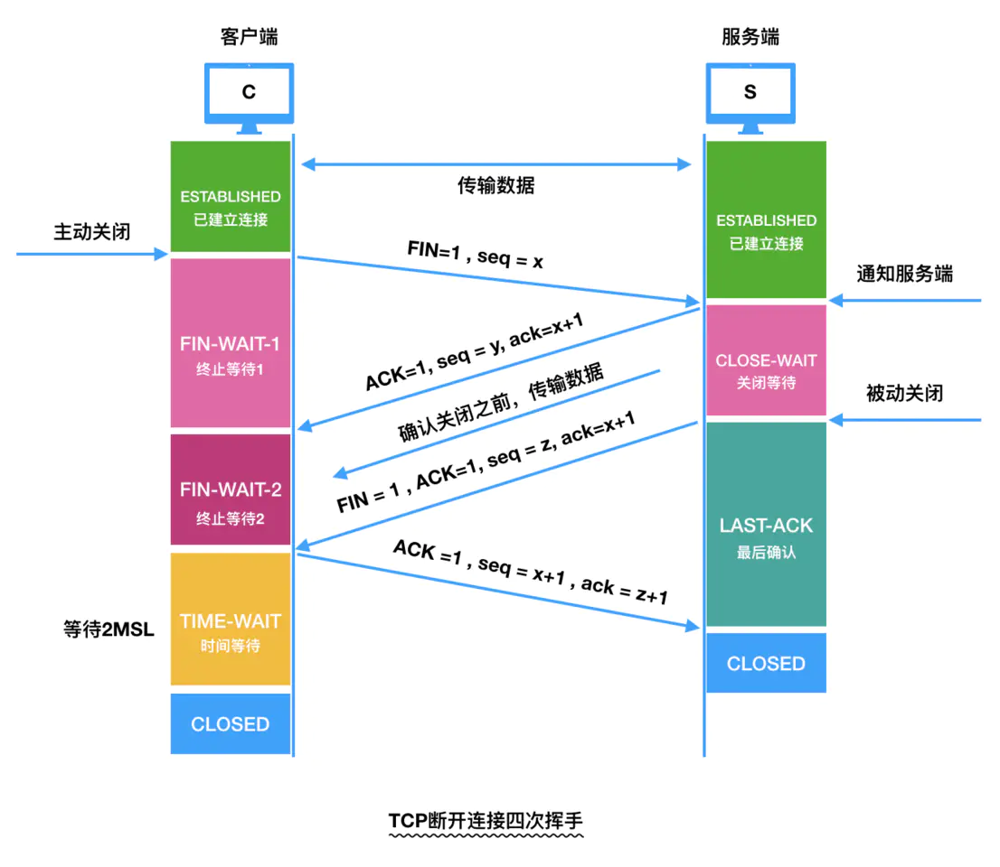
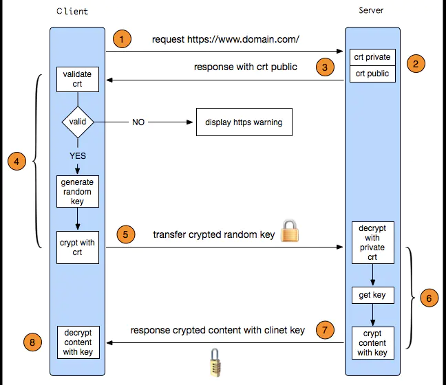

<!-- markdown-toc start - Don't edit this section. Run M-x markdown-toc-generate-toc again -->
**Table of Contents**

   * [网络](#网络)
      * [1 三次握手](#1-三次握手)
      * [2 四次挥手](#2-四次挥手)
      * [3 ARP协议](#3-arp协议)
      * [4 urllib和urllib2的区别](#4-urllib和urllib2的区别)
      * [5 Post和Get](#5-post和get)
      * [6 Cookie和Session](#6-cookie和session)
      * [7 apache和nginx的区别](#7-apache和nginx的区别)
      * [8 网站用户密码保存](#8-网站用户密码保存)
      * [9 HTTP和HTTPS](#9-http和https)
      * [10 XSRF和XSS](#10-xsrf和xss)
      * [11 幂等 Idempotence](#11-幂等-idempotence)
      * [12 RESTful架构(SOAP,RPC)](#12-restful架构soaprpc)
      * [13 SOAP](#13-soap)
      * [14 RPC](#14-rpc)
      * [15 CGI和WSGI](#15-cgi和wsgi)
      * [16 中间人攻击](#16-中间人攻击)
      * [17 c10k问题](#17-c10k问题)
      * [18 socket](#18-socket)
      * [19 浏览器缓存](#19-浏览器缓存)
      * [20 HTTP1.0和HTTP1.1](#20-http10和http11)
      * [21 Ajax](#21-ajax)
<!-- markdown-toc end -->

# OSI（开放系统互连参考模型）7层

## 说明

- **应用层（7）**
用户与网络的界面（最复杂的一层）。
	协议：FTP，SMTP，HTTP
- **表示层（6）**
处理在两个通信系统中交换信息的表示方式（采用抽象的标准方法定义数据结构）数据压缩，加解密
- **会话层（5）**
利用传输层的服务，建立进程间的同步（SYN）
- **传输层（4）（运输层）**
传输单位：报文段（TCP）或用户数据段（UDP），负责主机间进程的通信（面向连接）；端到端，可靠传输服务。
功能：流量控制，差错控制，服务质量，数据传输管理等服务：
协议：TCP，UDP
- **网络层（3）**
单位：数据报/分组
任务：把网络层的协议数据单元（分组）从源端到目的端，关键问题（路由选择）
功能：流量控制，拥塞控制，差错控制，网际互联。
协议：IP，IPX，ICMP，ARP，RARP，OSPF。有可靠传输与不可靠传输。
- **数据链路层（2）**
单位：帧
任务：将网络层传来的IP数据报组装成帧
功能：成帧，差错控制，流量控制，传输管理
一个子层：介质访问子层（MAC子层）：控制对共享信道的访问
协议：SDLC，HDLC，PPP，STP，帧中继
- **物理层（1）**
单位：比特
任务：透明传输比特流，定义数据终端设备（DTE）和数据通信设备（DCE）的物理与逻辑连接方法。

## TCP
TCP: 传输控制协议
UDP：用户数据报协议
工作在传输层
### 1 TCP三次握手

- 第一次握手🤝： 客户端向服务器发出连接请求报文，这时报文首部中的同部位SYN=1，同时随机生成初始序列号 seq=x，此时，客户端进程进入了 SYN-SENT状态，等待服务器的确认。
- 第二次握手🤝： 服务器收到请求报文后，如果同意连接，则发出确认报文。确认报文中应该 ACK=1，SYN=1，确认号是ack=x+1，同时也要为自己随机初始化一个序列号 seq=y，此时，服务器进程进入了SYN-RCVD状态，询问客户端是否做好准备。
- 第三次握手🤝： 客户端进程收到确认后，还要向服务器给出确认。确认报文的ACK=1，ack=y+1，此时，连接建立，客户端进入ESTABLISHED状态，服务器端也进入ESTABLISHED状态。

#### 握手🤝为什么需要三次呢，如果把最后一次的去掉改为两次握手🤝是否可行呢?
假如现在客户端想向服务端进行握手，它发送了第一个连接的请求报文，但是由于网络信号差或者服务器负载过多，这个请求没有立即到达服务端，而是在某个网络节点中长时间的滞留了，以至于滞留到客户端连接释放以后的某个时间点才到达服务端，那么这就是一个失效的报文，但是服务端接收到这个失效的请求报文后，就误认为客户端又发了一次连接请求，服务端就会想向客户端发出确认的报文，表示同意建立连接。
假如不采用三次握手，那么只要服务端发出确认，表示新的建立就连接了。但是现在客户端并没有发出建立连接的请求，其实这个请求是失效的请求，一切都是服务端在自相情愿，因此客户端是不会理睬服务端的确认信息，也不会向服务端发送确认的请求，但是服务器却认为新的连接已经建立起来了，并一直等待客户端发来数据，这样的情况下，服务端的很多资源就没白白浪费掉了。
采用三次握手的办法就是为了防止上述这种情况的发生，比如就在刚才的情况下，客户端不会向服务端发出确认的请求，服务端会因为收不到确认的报文，就知道客户端并没有要建立连接，那么服务端也就不会去建立连接，这就是三次握手的作用

### 2 TCP四次挥手

_注意: 中断连接端可以是客户端，也可以是服务器端. 下面仅以客户端断开连接举例, 反之亦然._

- 第一次挥手👋：  客户端进程发出连接释放FIN报文，并且停止发送数据。释放数据报文首部，FIN=1，其序列号为seq=x,此时，客户端进入FIN-WAIT-1（终止等待1）状态。
- 第二次挥手👋：  服务端进程收到连接释放FIN报文，发出确认ACK报文，ACK=1，ack=x+1，并且带上自己的序列号seq=y，此时，服务端就进入了CLOSE-WAIT（关闭等待）状态。此时，服务端通知高层的应用进程，客户端向服务端的方向就释放了，这时候处于半关闭状态，即客户端已经没有数据要发送了，但是服务端若发送数据，客户端依然要接受。这个状态还要持续一段时间，也就是整个CLOSE-WAIT状态持续的时间。客户端收到服务端的确认请求后，此时，客户端就进入FIN-WAIT-2（终止等待2）状态，等待服务器发送连接释放报文，在这之前依然可以接收服务端发送过来的最后的数据。
- 第三次挥手👋： 服务端将最后的数据发送给客户端完成后，就向客户端发送连接释放FIN报文，FIN=1，ack=x+1，此时的序列号为seq=z，此时，服务端就进入了LAST-ACK（最后确认）状态，等待客户端的确认。
- 第四次挥手👋： 客户端接收到服务端的连接释放FIN报文后，必须发出确认报文，ACK=1，ack=z+1，而自己的序列号是seq=x+1，此时，客户端就进入了TIME-WAIT（时间等待）状态。此时服务端收到客户端发送过来的确认报文，就立即撤销自己的传输控制块TCB,进入CLOSED状态，注意此时的TCP连接还没有释放，必须经过2MSL（最长报文段寿命）的时间后，客户端没有收到服务端发来的任何数据，证明服务端已正常关闭，此时客户端会撤销相应传输控制块TCB后，进入CLOSED状态。至此，TCP的连接才真正的断开了。（服务端结束TCP连接的时间要比客户端稍微早一些）

#### 为什么断开连接需要四次挥手👋呢，像建立连接的时候一样，三次行不行呢？
TCP协议是一种面向连接的、可靠的、基于字节流的运输层通信协议。TCP是全双工 模式，这就意味着，在客户端想要断开连接时，客户端向服务端发送FIN报文，只是表示客户端已经没有数据要发送了，但是这个时候客户端还是可以接收来自服务端的数据。
当服务端接收到FIN报文，并返回ACK报文，表示服务端已经知道了客户端要断开连接，客户端已经没有数据要发送了，但是这个时候服务端可能依然有数据要传输给客户端。
当服务端的数据传输完之后，服务端会发送FIN报文给客户端，表示服务端也没有数据要传输了，服务端同意关闭连接，之后，客户端收到FIN报文，立即发送给客户端一个ACK报文，确定关闭连接。在之后，客户端和服务端彼此就愉快的断开了这次的TCP连接。
或许会有疑问，为什么服务端的ACK报文和FIN报文都是分开发送的，但是在三次握手的时候却是ACK报文和SYN报文是一起发送的，因为在三次握手的过程中，当服务端收到客户端的SYN连接请求报文后，可以直接发送SYN+ACK报文。其中ACK报文是用来应答的，SYN报文是用来同步的。但是在关闭连接时，当服务端接收到FIN报文时，很可能并不会立即关闭SOCKET，所以只能先回复一个ACK报文，告诉客户端，你发的FIN报文我收到了，只有等到服务端所有的数据都发送完了，才能发送FIN报文，因此ACK报文和FIN报文不能一起发送。所以断开连接的时候才需要四次挥手来完成。

参考：https://juejin.im/post/5d5414cb6fb9a06b20055e27

### TCP可靠传输
1、序号：用来保证数据能有序提交给应用层
2、确认：确认号为期待收到的下一个报文段第一个字节的序号
3、重传：
超时：计时器到期还没收到确认则重传对应报文
冗余确认：当收到失序报文时向发送端发送冗余ACK

### TCP流量控制
在确认报文中设置接收窗口rwnd的值来限制发送速率
发送窗口的实际大小是取rwnd和cwnd中的最小值
#### 常见的 TCP 拥塞控制算法
**Reno**
适用于低延时、低带宽的网络，它将拥塞控制的过程分为四个阶段：慢启动、拥塞避免、快重传和快恢复
rwnd：接收窗口
cwnd：拥塞窗口
ssthresh：慢开始门限
原理：根据自己估算的网络拥塞程度设置cwnd的值来限制发送速率
方法：
慢开始：当cwnd<ssthresh时，每收到一个报文段的确认cwnd+1
拥塞避免：当cwnd>ssthresh时，每经过一个往返时延cwnd+1
快重传：当收到连续三个重复的ACK，直接重传对方期待的报文
快恢复：当收到连续的三个冗余ACK，令ssthresh=cwnd=cwnd/2
拥塞处理：ssthresh置为原来的一般，cwnd置1

**BBR**
知道就好

## UDP与TCP区别
- TCP面向连接，UDP面向非连接
- TCP提供可靠的服务（数据传输无差错、不丢失、不重复、按序到达），UDP不可靠
- TCP面向字节流，UDP面向报文
- TCP数据传输慢，UDP数据传输快
- TCP首部开销20字节，UDP8字节

# 网络
## 3 ARP协议

地址解析协议(Address Resolution Protocol)，其基本功能为透过目标设备的IP地址，查询目标的MAC地址，以保证通信的顺利进行。它是IPv4网络层必不可少的协议，不过在IPv6中已不再适用，并被邻居发现协议（NDP）所替代。

## 4 urllib和urllib2的区别

这个面试官确实问过,当时答的urllib2可以Post而urllib不可以.

1. urllib提供urlencode方法用来GET查询字符串的产生，而urllib2没有。这是为何urllib常和urllib2一起使用的原因。
2. urllib2可以接受一个Request类的实例来设置URL请求的headers，urllib仅可以接受URL。这意味着，你不可以伪装你的User Agent字符串等。

## 5 Post和Get
[GET和POST有什么区别？及为什么网上的多数答案都是错的](http://www.cnblogs.com/nankezhishi/archive/2012/06/09/getandpost.html)
[知乎回答](https://www.zhihu.com/question/31640769?rf=37401322)

get: [RFC 2616 - Hypertext Transfer Protocol -- HTTP/1.1](http://tools.ietf.org/html/rfc2616#section-9.3)
post: [RFC 2616 - Hypertext Transfer Protocol -- HTTP/1.1](http://tools.ietf.org/html/rfc2616#section-9.5)

## 6 Cookie和Session

|      | Cookie                     | Session |
| :--- | :------------------------- | :------ |
| 储存位置 | 客户端                        | 服务器端    |
| 目的   | 跟踪会话，也可以保存用户偏好设置或者保存用户名密码等 | 跟踪会话    |
| 安全性  | 不安全                        | 安全      |

session技术是要使用到cookie的，之所以出现session技术，主要是为了安全。

## 7 apache和nginx的区别

nginx 相对 apache 的优点：
* 轻量级，同样起web 服务，比apache 占用更少的内存及资源
* 抗并发，nginx 处理请求是异步非阻塞的，支持更多的并发连接，而apache 则是阻塞型的，在高并发下nginx 能保持低资源低消耗高性能
* 配置简洁
* 高度模块化的设计，编写模块相对简单
* 社区活跃

apache 相对nginx 的优点：
* rewrite ，比nginx 的rewrite 强大
* 模块超多，基本想到的都可以找到
* 少bug ，nginx 的bug 相对较多
* 超稳定

## 8 网站用户密码保存

1. 明文保存
2. 明文hash后保存,如md5
3. MD5+Salt方式,这个salt可以随机
4. 知乎使用了Bcrypy(好像)加密

## 9 HTTP和HTTPS

### 状态码
| 状态码       | 定义               |
| :-------- | :--------------- |
| 1xx 报告    | 接收到请求，继续进程       |
| 2xx 成功    | 步骤成功接收，被理解，并被接受  |
| 3xx 重定向   | 为了完成请求,必须采取进一步措施 |
| 4xx 客户端出错 | 请求包括错的顺序或不能完成    |
| 5xx 服务器出错 | 服务器无法完成显然有效的请求   |
403: Forbidden
404: Not Found

### 状态码详解
| 状态码    | 状态  |方法| 定义               |
| :-------- | :---------------| :--------------- | :--------------- |
|200 |OK |GET|服务器成功返回用户请求的数据，该操作是幂等的（Idempotent）。
|201 |CREATED | POST/PUT/PATCH|用户新建或修改数据成功。
|202 |Accepted |\*|表示一个请求已经进入后台排队（异步任务）
|204 |NO CONTENT | DELETE|用户删除数据成功。
|400 |INVALID REQUEST | POST/PUT/PATCH|用户发出的请求有错误，服务器没有进行新建或修改数据的操作，该操作是幂等的。
|401| Unauthorized| \*|表示用户没有权限（令牌、用户名、密码错误）。
|403 |Forbidden | \*|表示用户得到授权（与401错误相对），但是访问是被禁止的。
|404 |NOT FOUND | \*|用户发出的请求针对的是不存在的记录，服务器没有进行操作，该操作是幂等的。
|406 |Not Acceptable | GET|用户请求的格式不可得（比如用户请求JSON格式，但是只有XML格式）。
|410| Gone |GET|用户请求的资源被永久删除，且不会再得到的。
|422| Unprocesable entity | POST/PUT/PATCH |当创建一个对象时，发生一个验证错误。
|500 |INTERNAL SERVER ERROR | \*|服务器发生错误，用户将无法判断发出的请求是否成功。
### HTTP

#### HTTP1.1版本新特性:
1. 默认持久连接节省通信量：只要客户端服务端任意一端没有明确提出断开TCP连接，就一直保持连接，可以发送多次HTTP请求
2. 管线化，客户端可以同时发出多个HTTP请求，而不用一个个等待响应
3. 断点续传：实际上就是利用HTTP消息头使用分块传输编码，将实体主体分块传输。
#### HTTP优化方案：
1. TCP复用：TCP连接复用是将多个客户端的HTTP请求复用到一个服务器端TCP连接上，而HTTP复用则是一个客户端的多个HTTP请求通过一个TCP连接进行处理。前者是负载均衡设备的独特功能；而后者是HTTP 1.1协议所支持的新功能
2. 内容缓存：将经常用到的内容进行缓存起来，那么客户端就可以直接在内存中获取相应的数据了。
3. 压缩：将文本数据进行压缩，减少带宽
4. SSL加速（SSL Acceleration）：使用SSL协议对HTTP协议进行加密，在通道内加密并加速
5. TCP缓冲：通过采用TCP缓冲技术，可以提高服务器端响应时间和处理效率，减少由于通信链路问题给服务器造成的连接负担。

#### URI和URL

各自的组成
1. URI
Web上可用的每种资源如HTML文档、图像、视频片段、程序等都是一个来URI来定位的；
URI一般由三部组成
①访问资源的命名机制
②存放资源的主机名
③资源自身的名称，由路径表示，着重强调于资源。
2. URL
URL是Internet上用来描述信息资源的字符串，主要用在各种WWW客户程序和服务器程序上，特别是著名的Mosaic。
采用URL可以用一种统一的格式来描述各种信息资源，包括文件、服务器的地址和目录等。
URL一般由三部组成
①协议(或称为服务方式)
②存有该资源的主机IP地址(有时也包括端口号)
③主机资源的具体地址。如目录和文件名等
URI：Uniform Resource Identifier，统一资源标识符
URL：Uniform Resource Location统一资源定位符

##### 关系
URI是一个用于标识互联网资源名称的字符串。 该种标识允许用户对网络中（一般指万维网）的资源通过特定的协议进行交互操作。URI的最常见的形式是统一资源定位符（URL），经常指定为非正式的网址。更罕见的用法是统一资源名称（URN），其目的是通过提供一种途径。用于在特定的命名空间资源的标识，以补充网址。
通俗地说，URL和URN是URI的子集，URI属于URL更高层次的抽象，一种字符串文本标准。

##### 有什么区别

- URI，是统一资源标识符，用来唯一的标识一个资源。
- URL是统一资源定位器，它是一种具体的URI，即URL可以用来标识一个资源，而且还指明了如何locate这个资源。
- URN，统一资源命名，是通过名字来标识资源，比如mailto:java-net@java.sun.com。

也就是说，URI是以一种抽象的，高层次概念定义统一资源标识，而URL和URN则是具体的资源标识的方式。URL和URN都是一种URI；
URL是URI的一种。但也不是所有的URI都是URL哦，就好像蝴蝶都会飞，但会飞的可不都是蝴蝶啊！
让URI能成为URL的当然就是那个“访问机制”，“网络位置”。e.g. http://
or ftp://.。URN是唯一标识的一部分，就是一个特殊的名字。

#### 什么是Http协议无状态协议?怎么解决Http协议无状态协议?
无状态协议对于事务处理没有记忆能力，缺少状态意味着如果后续处理需要前面的信息
也就是说，当客户端一次HTTP请求完成以后，客户端再发送一次HTTP请求，HTTP并不知道当前客户端是一个"老用户"。
可以使用Cookie来解决无状态的问题，Cookie就相当于一个通行证，第一次访问的时候给客户端发送一个Cookie，当客户端再次来的时候，拿着Cookie(通行证)，那么服务器就知道这个是"老用户"。

### HTTP与HTTPS的区别：
1. HTTP 的URL 以http://开头，而HTTPS 的URL 以https://开头
2. HTTP 是不安全的，而 HTTPS 是安全的
3. HTTP 标准端口是80 ，而 HTTPS 的标准端口是443
4. 在OSI 网络模型中，HTTP工作于应用层，而HTTPS 的安全传输机制工作在传输层（SSL TLS工作在会话层）
5. HTTP 无法加密，而HTTPS 对传输的数据进行加密
6. HTTP无需证书，而HTTPS 需要CA机构颁发的SSL证书

### HTTPS

HTTPS协议 = HTTP协议 + SSL/TLS协议

- SSL的全称是Secure Sockets Layer，即安全套接层协议，是为网络通信提供安全及数据完整性的一种安全协议。SSL协议在1994年被Netscape发明，后来各个浏览器均支持SSL，其最新的版本是3.0
- TLS的全称是Transport Layer Security，即安全传输层协议，最新版本的TLS（Transport Layer Security，传输层安全协议）是IETF（Internet Engineering Task Force，Internet工程任务组）制定的一种新的协议，它建立在SSL 3.0协议规范之上，是SSL 3.0的后续版本。在TLS与SSL3.0之间存在着显著的差别，主要是它们所支持的加密算法不同，所以TLS与SSL3.0不能互操作。

虽然TLS与SSL3.0在加密算法上不同，但是在我们理解HTTPS的过程中，我们可以把SSL和TLS看做是同一个协议。

HTTPS为了兼顾安全与效率，同时使用了**对称加密**和**非对称**加密。

对数据进行对称加密，对称加密所要使用的密钥通过非对称加密传输。

过程图示意:

详解：
一个HTTPS请求实际上包含了两次HTTP传输，可以细分为8步。
1.客户端向服务器发起HTTPS请求，连接到服务器的443端口
2.服务器端有一个密钥对，即公钥和私钥，是用来进行非对称加密使用的，服务器端保存着私钥，不能将其泄露，公钥可以发送给任何人。
3.服务器将自己的公钥发送给客户端。
4.客户端收到服务器端的证书之后，会对证书进行检查，验证其合法性，如果发现发现证书有问题，那么HTTPS传输就无法继续。严格的说，这里应该是验证服务器发送的数字证书的合法性，关于客户端如何验证数字证书的合法性，下文会进行说明。如果公钥合格，那么客户端会生成一个随机值，这个随机值就是用于进行对称加密的密钥，我们将该密钥称之为client key，即客户端密钥，这样在概念上和服务器端的密钥容易进行区分。然后用服务器的公钥对客户端密钥进行非对称加密，这样客户端密钥就变成密文了，至此，HTTPS中的第一次HTTP请求结束。
5.客户端会发起HTTPS中的第二个HTTP请求，将加密之后的客户端密钥发送给服务器。
6.服务器接收到客户端发来的密文之后，会用自己的私钥对其进行非对称解密，解密之后的明文就是客户端密钥，然后用客户端密钥对数据进行对称加密，这样数据就变成了密文。
7.然后服务器将加密后的密文发送给客户端。
8.客户端收到服务器发送来的密文，用客户端密钥对其进行对称解密，得到服务器发送的数据。这样HTTPS中的第二个HTTP请求结束，整个HTTPS传输完成。

### HTTPS在传输的过程中会涉及到三个密钥

- 服务器端的公钥和私钥，用来进行非对称加密
- 客户端生成的随机密钥，用来进行对称加密

## 10 XSRF和XSS

* CSRF(Cross-site request forgery)跨站请求伪造
* XSS(Cross Site Scripting)跨站脚本攻击

CSRF重点在请求,XSS重点在脚本

## 11 幂等 Idempotence

HTTP方法的幂等性是指一次和多次请求某一个资源应该具有同样的**副作用**。(注意是副作用)

`GET http://www.bank.com/account/123456`，不会改变资源的状态，不论调用一次还是N次都没有副作用。请注意，这里强调的是一次和N次具有相同的副作用，而不是每次GET的结果相同。`GET http://www.news.com/latest-news`这个HTTP请求可能会每次得到不同的结果，但它本身并没有产生任何副作用，因而是满足幂等性的。

DELETE方法用于删除资源，有副作用，但它应该满足幂等性。比如：`DELETE http://www.forum.com/article/4231`，调用一次和N次对系统产生的副作用是相同的，即删掉id为4231的帖子；因此，调用者可以多次调用或刷新页面而不必担心引起错误。

POST所对应的URI并非创建的资源本身，而是资源的接收者。比如：`POST http://www.forum.com/articles`的语义是在`http://www.forum.com/articles`下创建一篇帖子，HTTP响应中应包含帖子的创建状态以及帖子的URI。两次相同的POST请求会在服务器端创建两份资源，它们具有不同的URI；所以，POST方法不具备幂等性。

PUT所对应的URI是要创建或更新的资源本身。比如：`PUT http://www.forum/articles/4231`的语义是创建或更新ID为4231的帖子。对同一URI进行多次PUT的副作用和一次PUT是相同的；因此，PUT方法具有幂等性。

## 12 RESTful架构(SOAP,RPC)

推荐: http://www.ruanyifeng.com/blog/2011/09/restful.html

## 13 SOAP

SOAP（原为Simple Object Access Protocol的首字母缩写，即简单对象访问协议）是交换数据的一种协议规范，使用在计算机网络Web服务（web service）中，交换带结构信息。SOAP为了简化网页服务器（Web Server）从XML数据库中提取数据时，节省去格式化页面时间，以及不同应用程序之间按照HTTP通信协议，遵从XML格式执行资料互换，使其抽象于语言实现、平台和硬件。

## 14 RPC

RPC（Remote Procedure Call Protocol）——远程过程调用协议，它是一种通过网络从远程计算机程序上请求服务，而不需要了解底层网络技术的协议。RPC协议假定某些传输协议的存在，如TCP或UDP，为通信程序之间携带信息数据。在OSI网络通信模型中，RPC跨越了传输层和应用层。RPC使得开发包括网络分布式多程序在内的应用程序更加容易。

总结:服务提供的两大流派.传统意义以方法调用为导向通称RPC。为了企业SOA,若干厂商联合推出webservice,制定了wsdl接口定义,传输soap.当互联网时代,臃肿SOA被简化为http+xml/json.但是简化出现各种混乱。以资源为导向,任何操作无非是对资源的增删改查，于是统一的REST出现了.

进化的顺序: RPC -> SOAP -> RESTful

## 15 CGI和WSGI
CGI是通用网关接口，是连接web服务器和应用程序的接口，用户通过CGI来获取动态数据或文件等。
CGI程序是一个独立的程序，它可以用几乎所有语言来写，包括perl，c，lua，python等等。

WSGI, Web Server Gateway Interface，是Python应用程序或框架和Web服务器之间的一种接口，WSGI的其中一个目的就是让用户可以用统一的语言(Python)编写前后端。

官方说明：[PEP-3333](https://www.python.org/dev/peps/pep-3333/)

## 16 中间人攻击

在GFW里屡见不鲜的,呵呵.

中间人攻击（Man-in-the-middle attack，通常缩写为MITM）是指攻击者与通讯的两端分别创建独立的联系，并交换其所收到的数据，使通讯的两端认为他们正在通过一个私密的连接与对方直接对话，但事实上整个会话都被攻击者完全控制。

## 17 c10k问题

所谓c10k问题，指的是服务器同时支持成千上万个客户端的问题，也就是concurrent 10 000 connection（这也是c10k这个名字的由来）。
推荐: https://my.oschina.net/xianggao/blog/664275

## 18 socket

推荐: http://www.360doc.com/content/11/0609/15/5482098_122692444.shtml

Socket=Ip address+ TCP/UDP + port

## 19 浏览器缓存

推荐: http://www.cnblogs.com/skynet/archive/2012/11/28/2792503.html

304 Not Modified

## 20 HTTP1.0和HTTP1.1

推荐: http://blog.csdn.net/elifefly/article/details/3964766

1. 请求头Host字段,一个服务器多个网站
2. 长链接
3. 文件断点续传
4. 身份认证,状态管理,Cache缓存

HTTP请求8种方法介绍 
HTTP/1.1协议中共定义了8种HTTP请求方法，HTTP请求方法也被叫做“请求动作”，不同的方法规定了不同的操作指定的资源方式。服务端也会根据不同的请求方法做不同的响应。

GET

GET请求会显示请求指定的资源。一般来说GET方法应该只用于数据的读取，而不应当用于会产生副作用的非幂等的操作中。

GET会方法请求指定的页面信息，并返回响应主体，GET被认为是不安全的方法，因为GET方法会被网络蜘蛛等任意的访问。

HEAD

HEAD方法与GET方法一样，都是向服务器发出指定资源的请求。但是，服务器在响应HEAD请求时不会回传资源的内容部分，即：响应主体。这样，我们可以不传输全部内容的情况下，就可以获取服务器的响应头信息。HEAD方法常被用于客户端查看服务器的性能。

POST

POST请求会 向指定资源提交数据，请求服务器进行处理，如：表单数据提交、文件上传等，请求数据会被包含在请求体中。POST方法是非幂等的方法，因为这个请求可能会创建新的资源或/和修改现有资源。

PUT

PUT请求会身向指定资源位置上传其最新内容，PUT方法是幂等的方法。通过该方法客户端可以将指定资源的最新数据传送给服务器取代指定的资源的内容。

DELETE

DELETE请求用于请求服务器删除所请求URI（统一资源标识符，Uniform Resource Identifier）所标识的资源。DELETE请求后指定资源会被删除，DELETE方法也是幂等的。

CONNECT

CONNECT方法是HTTP/1.1协议预留的，能够将连接改为管道方式的代理服务器。通常用于SSL加密服务器的链接与非加密的HTTP代理服务器的通信。

OPTIONS

OPTIONS请求与HEAD类似，一般也是用于客户端查看服务器的性能。 这个方法会请求服务器返回该资源所支持的所有HTTP请求方法，该方法会用’*’来代替资源名称，向服务器发送OPTIONS请求，可以测试服务器功能是否正常。JavaScript的XMLHttpRequest对象进行CORS跨域资源共享时，就是使用OPTIONS方法发送嗅探请求，以判断是否有对指定资源的访问权限。 允许

TRACE

TRACE请求服务器回显其收到的请求信息，该方法主要用于HTTP请求的测试或诊断。

HTTP/1.1之后增加的方法

在HTTP/1.1标准制定之后，又陆续扩展了一些方法。其中使用中较多的是 PATCH 方法：

PATCH

PATCH方法出现的较晚，它在2010年的RFC 5789标准中被定义。PATCH请求与PUT请求类似，同样用于资源的更新。二者有以下两点不同：

但PATCH一般用于资源的部分更新，而PUT一般用于资源的整体更新。 
当资源不存在时，PATCH会创建一个新的资源，而PUT只会对已在资源进行更新。

## 21 Ajax
AJAX,Asynchronous JavaScript and XML（异步的 JavaScript 和 XML）, 是与在不重新加载整个页面的情况下，与服务器交换数据并更新部分网页的技术。
